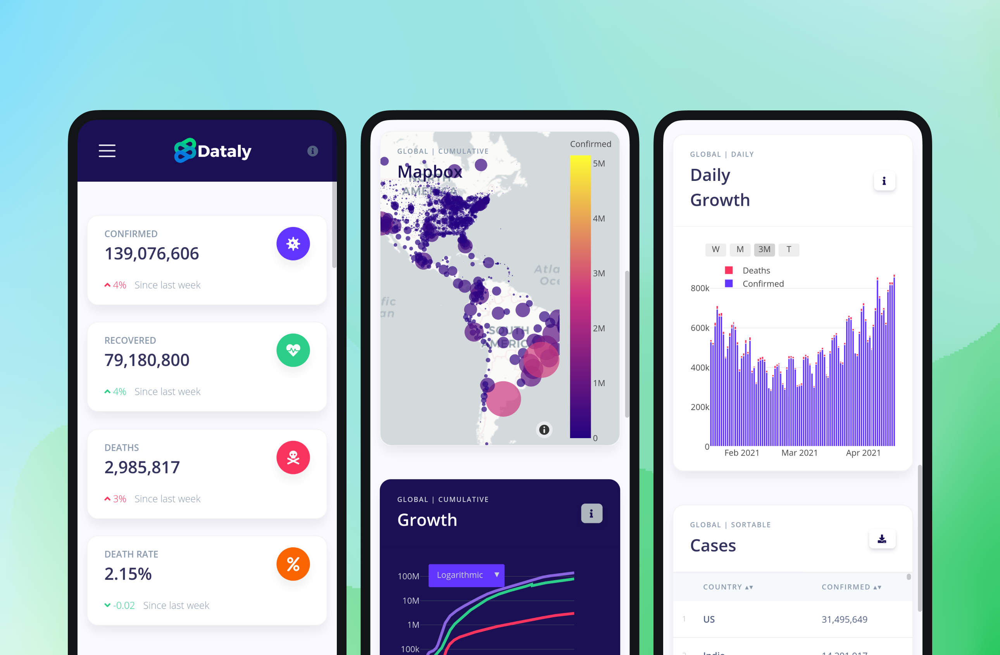

# Why start this project?

When I started this side project there were not too many dashboards or sites to track data for the Coronavirus pandemic, other than the very popular web app created by John Hopkins University. My idea was to create an open-source version that encouraged collaboration to derive some creative design and functional ideas. And, that’s precisely what this project became.

> COVID-19 is an infectious disease caused by a newly discovered coronavirus. The best way to prevent and slow down transmission is to be well informed.
> —<span>&nbsp;</span>who.int<span>&nbsp;</span>(2020)

We have [contributors from all over the world](https://github.com/BrianRuizy/covid19-dashboard/graphs/contributors) --Spain, Poland, India, and various places in the USA-- who came together to create something useful and meaningful. Furthermore, the site has accumulated over 10k visits as shown by web analytics. And, the project is still being maintained and improved upon, thanks to the help of developers.

---

# Where does the data comes from?

A large portion of the data comes from one of the original data repositories tracking COVID-19 cases, [Johns Hopkins University](https://github.com/CSSEGISandData/COVID-19) CSSE2019-ncov data repository. Additional data was collected from [Our World in Data](https://ourworldindata.org/) GitHub data repository. Lastly, to fill in some requirements we retrieved data for daily cases from [New York Times](https://github.com/nytimes/covid-19-data) COVID GitHub data repository.

For this project, it was crucial to have <mark>accurate, and trustworthy datasets</mark>.
Which explains why the multiple aforementioned sources were diligently picked.
In doing so the goal is to provide the most accurate representations of the pandemic, the opposite could have its own repercussions at scale.


# Technology stack

This project began with Python-based Jupyter notebooks, and the use of Plotly, “the leading front-end for ML & data science models in Python, R, and Julia.” Django. But I needed a way for this to be accessible to the public therefore I started using the Django web framework, Django is a high-level Web framework that encourages rapid development and clean, pragmatic design. To bootstrap the initial dashboard grid we used Appseed and Bootstrap 4 to fill in where we needed custom UI elements.

Several times I reconsidered the deployment of this project, but ultimately decided to deploy it to Heroku. Heroku is a cloud-based platform that offers an easy way to deploy your Django-based web applications. Though other contenders included elastic beanstalk (AWS) and Google App Engine, Heroku included tools that seemed much more valuable at a free tier. Furthermore, Heroku provides seamless CI and made it super easy to test pull requests from other contributors.


# Front-end design

Overall the general approach of the application is to display a grid of different cards. The cards represent different forms of data organized in their respective way, and the user can interact with the data in several ways. We have a map card that uses COVID case data stacked on top of GPS coordinates. In another card, we have a plot that shows the overall trajectory of confirmed cases using time-series data with dates.

And, it was important to design the grid in such a way that the cards of data were responsive and friendly to different devices and viewports. Bootstrap 4 allowed to easily create device repsonive grid.



# How it works

The following is a snippet of how we’re using <mark>Python to scrape the data from different sources and returning that data to the front-end</mark> to create data visualizations with Plotly. Using AJAX requests allows us to load the data asynchronously, which is a great way to improve the user experience by significantly reducing the initial page load time.

<Alert severity="warning">
  Note that example code is incomplete for concision.
</Alert>

## 1. Web scraping with Pandas 🐼

Here we defined a simple function that reads from a specific URL that contains a CSV of raw data, we convert it to a Pandas data frame and return it.

```python
import pandas as pd

def confirmed_report():
  # Returns time series version of total cases confirmed globally
  df = pd.read_csv('https://raw...CSSEGISandData/...csv')
  return df
```

## 2. Data cleaning & formatting 🧼

Now we define the function realtime_growth which cleans and manipulates the data frame returned from the above function. We need to do this because the data is not in the format we want, and we need to clean it up.

```py
def realtime_growth():
  df1 = confirmed_report()[confirmed_report().columns[4:]].sum()
  df2 = deaths_report()[deaths_report().columns[4:]].sum()

  growth_df = pd.DataFrame([])
  growth_df['Confirmed'], growth_df['Deaths'] = df1, df2
  growth_df.index = growth_df.index.rename('Date')

  yesterday = pd.Timestamp('now').date() - pd.Timedelta(days=1)

  return growth_df
```

## 3. Sending AJAX request 📨

Using AJAX in javascript to send an asynchronous request to the Python backend. If successful then we create the data visualization — in this case, a scatter plot with visible line traces — using plotly.js.

```js
function load_realtime_growth_chart() {
  var xhttp = new XMLHttpRequest()
  xhttp.onreadystatechange = function () {
    if (this.readyState == 4 && this.status == 200) {
      /* plotly.js code here*/
    }
  }
  xhttp.open("GET", "realtime_growth")
  xhttp.send()
}
```

## 5. Plotly to visualize the data 📊

We then create the D3.js-based line and scatter plots in JavaScript using Plotly. This creates an interactive, scientific data visualization easily on the Web browser. This one will probably be the most complex-looking part of the code because it takes a lot of tweaking to get the plot to your desired look and feel. But trust me it’s simpler than it looks.

<Alert severity="info">
  Visit <a href="https://plotly.com/python/">plot.ly</a> for docs and examples.
</Alert>

```js
var plot_data = [confirmed_trace, deaths_trace];
var plot_layout = {
    paper_bgcolor:'rgba(0,0,0,0)',
    plot_bgcolor:'rgba(0,0,0,0)',
    yaxis: {automargin: true, type: "log", gridcolor: "#32325d"},
    xaxis: {automargin: true, showgrid: false},
    showlegend: false,
    font: {color: '#ced4da'},
    margin: {t:0, l:0, r:0, b:0},
    hovermode: "closest",
    updatemenus: [
      {
        visible: true,
        type: "dropdown",
        buttons: [
          {
            method: "relayout",
            label: "Logarithmic",
            args: [{"yaxis.type": "log"}]
          },
          {
            method: "relayout",
            label: "Linear",
            args: [{"yaxis.type": "linear"}]
          }
        ],
        x: 0.05,
        xanchor: "auto",
        bgcolor: "#6236FF",
        bordercolor: "rgba(0,0,0,0)"
      }
    ]
  };
);
```

# Wrapping things up

In the end, we have fully functional real-time data visualizations that are responsive to different devices and fully interactive to both mouse and touch controls. All in <mark>the most effective content delivery system that exists</mark>, the internet.

So did I achieve my initial goal? Yes, exceedingly, I believe. There is a tremendous amount of appreciation for this project knowing that tens of thousands of users have even opened the website and interacted with it. And, the idea that some of those users learned a little more about the pandemic is rewarding.

If you’re a developer and wish to contribute to the ongoing project you may check out the more in-depth documentation on the [getting started](https://github.com/BrianRuizy/covid19-dashboard/#getting-started) section from the Github repository.

---

<SpecialLink
  href={"https://ncov-dashboard.herokuapp.com/"}
  title={"Project Demo"}
  description={"Check out the live project demo on Heroku"}
  site={"herokuapp.com"}
  image={"https://miro.medium.com/max/1200/1*kg8aAUNxI055OhNhT04srQ.png"}
/>

<SpecialLink
  href={"https://github.com/BrianRuizy/covid19-dashboard"}
  title={"Github Repository"}
  description={"Check out codebase on Github"}
  site={"github.com"}
  image={
    "https://www.logo.wine/a/logo/GitHub/GitHub-Wordmark-White-Dark-Background-Logo.wine.svg"
  }
/>
